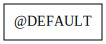

# MDI Mechanic GAMESS report

This repo presents test results for the MDI interface implementation in the GAMESS code.

To view the README.md offline, it is suggested that you use grip (i.e., pip install grip).

[yaml]: <> ( prepend )
## Usage Instructions

This repo does not include a distribution of the GAMESS software package; users must acquire the source code of GAMESS seperately.
The GAMESS source code must then be copied into a `source/gamess` subdirectory within this repository.
Afterwords, the repo can be built using the `mdimechanic build` and `mdimechanic report` commands.

## Overview of steps

The following lists the basic steps required to run a MDI calculation.
MDI Mechanic will automatically test each of these steps and indicate whether each one is currently working or not.

[comment]: <> (Badges are downloaded from shields.io, i.e.:)
[comment]: <> (curl https://img.shields.io/badge/-working-success --output report/badges/-working-success.svg)

1.  The engine builds successfully
2.  The engine supports minimalistic MDI functionality
3.  The engine correctly responds to unsupported MDI commands
4.  Full analysis of the engine's supported nodes and commands was completed

## Nodes

The graph indicates which nodes have been implemented in this engine and the connections between them.

## Commands

The following table indicates which MDI Standard commands are supported by this engine at each node.
Supported commands are indicated in green, while unsupported commands are indicated in gray.

[travis]: <> ( supported_commands )

## Acknowledgements

Badges are obtained from the  project.
